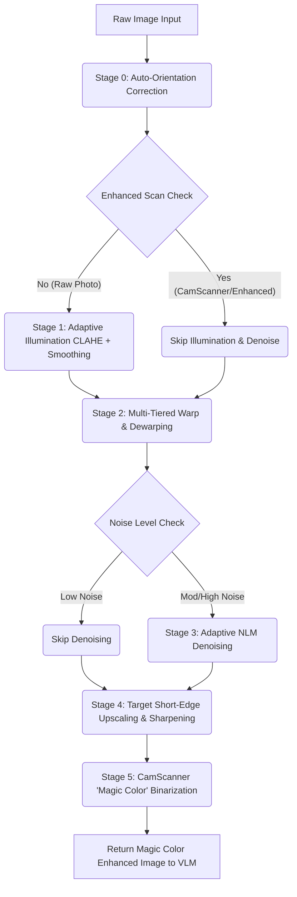

# Preprocessing Architecture Overview: 6-Stage VLM-Optimized Engine

This document provides the high-level system architecture and blueprint for the document preprocessing layer. The engine is optimized to prepare thermal receipts and invoices for downstream visual language models (such as **PaddleOCR-VL 1.6** and **Qwen2.5-VL**).


---

## 1. Architectural Evolution: 4-Stage vs. 6-Stage Pipeline

Initially, the project utilized a legacy 4-stage pipeline that was susceptible to camera perspective skew and shadow artifacts. The pipeline was restructured into a **6-stage modular engine** (incorporating active orientation correction, illumination normalization, multi-tiered warping, and color-preserving binarization).

```
   LEGACY 4-STAGE PIPELINE                     VLM-OPTIMIZED 6-STAGE ENGINE
   =======================                     ============================

      [ Raw Image Input ]                          [ Raw File Input (PDF/Img) ]
               │                                                │
               ▼                                                ▼
   ┌───────────────────────┐                      ┌────────────────────────────┐
   │   Stage 1: Deskew     │                      │ Stage 0: Orientation Align │
   │  (2D Flat Rotation)   │                      │  (Projection Profiling)    │
   └───────────────────────┘                      └─────────────┬──────────────┘
               │                                                │
               ▼                                                ▼
   ┌───────────────────────┐                      ┌────────────────────────────┐
   │   Stage 2: Denoise    │                      │ Stage 1: Illumination Norm │
   │     (h=2, Size=5)     │                      │ (LAB CLAHE & Div. Normal)  │
   └───────────────────────┘                      └─────────────┬──────────────┘
               │                                                │
               ▼                                                ▼
               │                                  ┌────────────────────────────┐
               │                                  │ Stage 2: Precision Warp    │
               │                                  │ (Bilateral Sweep & Deskew) │
               │                                  └─────────────┬──────────────┘
               │                                                │
               ▼                                                ▼
   ┌───────────────────────┐                      ┌────────────────────────────┐
   │   Stage 3: Upscale    │                      │ Stage 3: Adaptive Denoise  │
   │  (Bicubic Expansion)  │                      │ (Noise Profiling & Bypass) │
   └───────────────────────┘                      └─────────────┬──────────────┘
               │                                                │
               ▼                                                ▼
   ┌───────────────────────┐                      ┌────────────────────────────┐
   │   Stage 4: Binarize   │                      │ Stage 4: High-Res Upscale  │
   │ (Adaptive Gaussian)   │                      │ (1200px Short Edge Target) │
   └───────────────────────┘                      └─────────────┬──────────────┘
               │                                                │
               ▼                                                ▼
   [ True-to-Life Grayscale ]                     ┌────────────────────────────┐
                                                  │ Stage 5: Magic Color Bin   │
                                                  │ (Color-Preserving Overlay) │
                                                  └─────────────┬──────────────┘
                                                                │
                                                                ▼
                                                   [ Pristine OCR-Ready BGR ]
```

---

## 2. Ingestion Gatekeeper (`main.py`)

To support both image files (`.jpg`, `.png`, `.jpeg`) and multi-page documents (`.pdf`), the pipeline runs an ingestion gatekeeper. PDFs are unpacked in-memory using `pdf2image` into a sequence of NumPy `uint8` matrices. This unifies the execution path so all subsequent stages process standard OpenCV BGR matrices.

```
                  ┌──────────────────────────────┐
                  │   Incoming Raw File Stream   │
                  └──────────────┬───────────────┘
                                 │
                     [ Evaluate File Extension ]
                                 │
                   ┌─────────────┴─────────────┐
                   ▼                           ▼
            [ Image Upload ]                [ PDF Document ]
                   │                           │
         ( cv2.imread Matrix )      ( pdf2image page unpacking )
                   │                           │
                   └─────────────┬─────────────┘
                                 │
                                 ▼
              ┌─────────────────────────────────────┐
              │ Unified NumPy Matrix Pipeline Array │
              └─────────────────────────────────────┘
```

---

## 3. Operational Comparison: Legacy vs. Target vs. Final Implementation

| Pipeline Component | Legacy Preprocessing | CamScanner Target | Our VLM-Optimized Engine |
|---|---|---|---|
| **Primary Goal** | Smooth random pixel noise. | Produce a scanner-like high-contrast copy. | Maximize OCR/VLM text line detection and recognition accuracy. |
| **Stage 0: Orientation** | None. | Manual rotation inside app. | **Automatic**: Variance-based vertical/horizontal profiling aligns text upright. |
| **Stage 1: Illumination** | None. Shadows remained. | Flatten background lighting. | **Dynamic CLAHE + Division**: Normalizes shadows while adjusting to starting contrast. |
| **Stage 2: Geometry & Tilt** | 2D affine rotation only. | Draggable manual cropping nodes. | **Multi-Tiered Fallback**: Bilateral sweep, Otsu dark-bg, Canny hull, and text regression + fine profiling leveling. |
| **Stage 3: Noise Clean** | Hardcoded NLM filter. | Aggressive smoothing. | **Adaptive Bypass**: Measures image noise variance and skips stage if already clean. |
| **Stage 4: Resolution** | Rigid `2x` upscaling. | Constant print resize. | **Target Short-Edge Scaling**: Standardizes the short edge to `1200px` for optimal OCR. |
| **Stage 5: Contrast** | Black-and-white adaptive. | Uniform black ink. | **Magic Color Binarize**: Keeps background white while preserving ink stamp/logo colors. |

---

## 4. Overall Execution Flow Diagram


