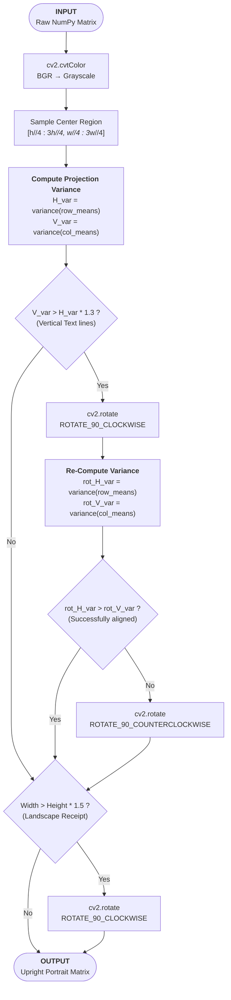

# Stage 0: Auto-Orientation Correction

## 1. Architectural Purpose (The "Why")
When photographing or scanning receipts, users frequently upload images rotated at $90^\circ$, $180^\circ$, or $270^\circ$. Downstream text line detection algorithms inside OCR/VLM engines assume standard horizontal lines of text. Feeding a rotated image into these models causes immediate extraction failures.

Stage 0 standardizes the input image by aligning it to an upright, vertical portrait format before running any thresholding or cropping operations.

---

## 2. Mathematical Concept & Mechanics
The orientation correction works by evaluating text line projection profiles. Because standard document layouts consist of horizontal text rows separated by white space, analyzing the variance of pixel projections along different dimensions reveals text orientation.

```
       [ Horizontal Text (Upright) ]                   [ Vertical Text (Rotated) ]
   
       Row Index   Intensity Profile Variance         Col Index   Intensity Profile Variance
       ---------   --------------------------         ---------   --------------------------
       Row 1 ( )   ████████████████ (High)            Col 1 ( )   ░░░░░░░░░░░░░░░░ (Low)
       Row 2 (T)   ░░░░░░░░░░░░░░░░                   Col 2 (T)   ░░░░░░░░░░░░░░░░
       Row 3 ( )   ████████████████                   Col 3 ( )   ░░░░░░░░░░░░░░░░
       Row 4 (e)   ░░░░░░░░░░░░░░░░                   Col 4 (e)   ░░░░░░░░░░░░░░░░
                   ================                           ================
                   Row Variance (H_var) >> Col                 Col Variance (V_var) >> Row
```

### Steps:
1. **Grayscale Conversion**: Converts the BGR matrix to single-channel grayscale to remove color noise.
2. **Central Region Sampling**: Extracts the central $50\%$ of the image (`[h//4:3*h//4, w//4:3*w//4]`) to focus on printed text body rows and avoid empty background margins.
3. **Variance Profiling**:
   - Calculates the average intensity per row, then computes the variance across these row averages ($H_{var}$).
   - Calculates the average intensity per column, then computes the variance across these column averages ($V_{var}$).
4. **90° / 270° Rotation Correction**:
   - If $V_{var} > 1.3 \times H_{var}$, text lines run vertically. The image is rotated $90^\circ$ clockwise.
   - The variance checks are re-run on the rotated matrix. If $V_{var}$ is still larger than $H_{var}$, the image is rotated $90^\circ$ counter-clockwise to resolve upside-down orientation.
5. **Landscape Formatting**:
   - If the width exceeds the height by a factor of $1.5$ ($w > 1.5 \times h$), the receipt is rotated $90^\circ$ clockwise into a standard vertical portrait profile.

---

## 3. Algorithmic Workflow & Decision Tree


