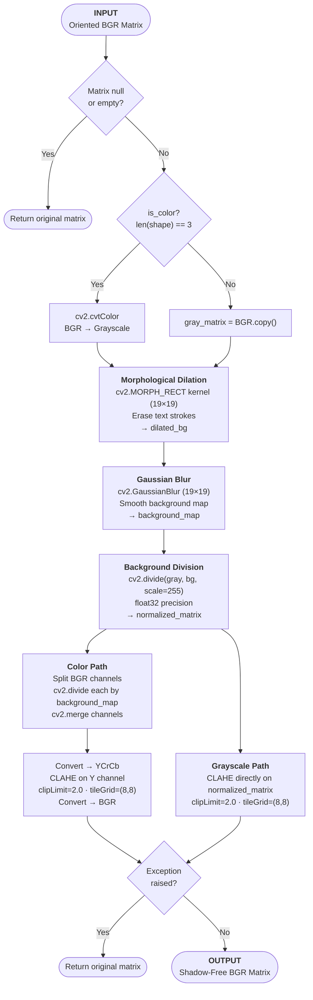

# Stage 1: Illumination Normalization

## 1. Architectural Purpose (The "Why")
Uneven overhead lighting, camera flash glare, and shadows cast across a document degrade contrast. When shadowed regions are fed into a standard binarization step, the character outlines compress in intensity, causing text to **shatter into unreadable fragments**.

Stage 1 mathematically separates text ink details from the background lighting grid using **Morphological Division**. It flattens lighting variations and maps shadows to a uniform white color before binarization runs.

---

## 2. Mathematical Concept & Mechanics
The normalization layer runs three mathematical operations in sequence:

### A. Dynamic LAB CLAHE (Contrast Limiting)
Standard global histogram equalization shifts intensity scales globally, washing out white backgrounds. To preserve details, the image is converted to the LAB color space, separating lightness ($L$) from chromatic values ($A$, $B$).
- **Lightness Standard Deviation ($\sigma_L$)**: Extracted from the $L$ channel.
- **Dynamic Clip Limit**: Equalization strength scales dynamically to prevent halos on bright documents while boosting low-contrast text.

### B. Background Isolation (Morphological Dilation)
To isolate shadow profiles without affecting characters, a morphological dilation is run using a wide rectangular structure element:
- A $19 \times 19$ kernel dilates bright paper pixels, painting over thin text lines completely.
- A Gaussian blur smooths out harsh edge boundaries, producing a continuous gradient representing the background illumination profile ($B$).

### C. Background Division (Shadow Neutralization)
The normalized output is computed by dividing the original pixel grid ($I$) by the background illumination profile ($B$):

$$\text{Output} = \left( \frac{I}{B} \right) \times 255$$

Since shadowed areas are dim in both $I$ and $B$, dividing them scales the pixels back to full brightness — removing shadows while keeping text ink details intact.

---

## 3. Algorithmic Workflow

