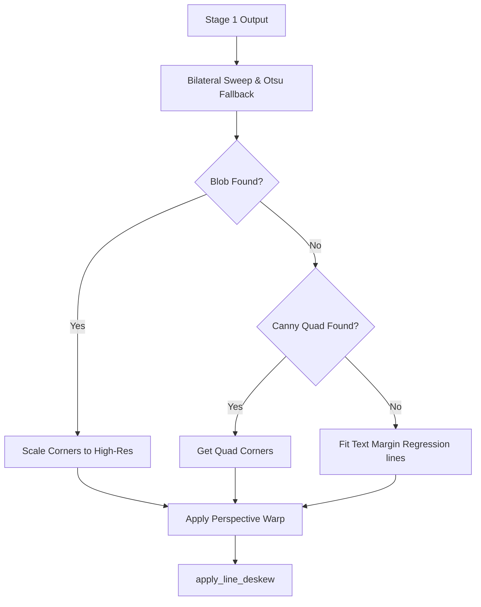
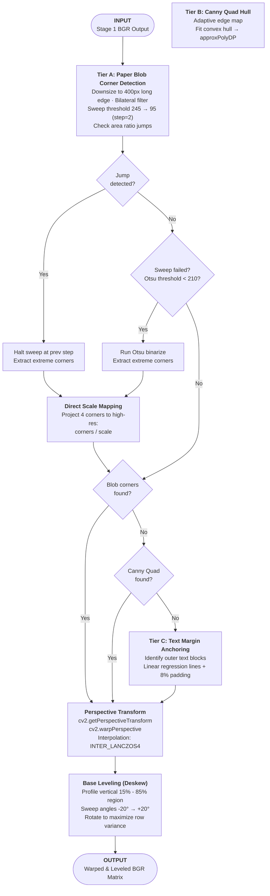

# Stage 2: Precision Warp & Perspective Dewarping

## 1. Architectural Purpose (The "Why")
Thermal receipts and invoice documents photographed on phones are almost always skewed by 3D perspective distortion (foreshortening). Standard 2D rotation cannot correct these angled dimensions.

Stage 2 locates the four true corners of the receipt page, crops out the desk/table background, executes a Homography perspective transform to flatten the document, and runs a projection variance sweep to align text lines to a perfect $0^\circ$ horizon.

---

## 2. Multi-Tiered Corner Detection Strategy

### Tier A: Bilateral Sweep & Dynamic Jump Halting (Primary)
To segment receipt paper from textured surfaces (e.g., marble, wood grain):
1. **Downscale Analysis**: Resizes the image to a $400\text{px}$ long edge and runs a bilateral filter (`d=9`, `sigmaColor=75`) to smooth wood/marble textures while maintaining hard receipt borders.
2. **Threshold Sweep**: Sweeps binary thresholds from $245$ down to $95$ in steps of 2.
3. **Dynamic Jump Halting**: At each step, evaluates the contour area coverage. If a sudden jump in the area ratio occurs ($>0.16$ when area $<60\%$, or $>0.10$ when area $\ge 60\%$), it signals background table bleed. The sweep halts immediately at the step *before* the jump, locking in the receipt boundary.
4. **Otsu Fallback**: If the sweep fails, Otsu binarization is run (triggered only if Otsu threshold value $<210$, confirming a dark background) to segment the paper blob.
5. **Direct Scale Mapping**: Extracts extreme points (Top-Left, Top-Right, Bottom-Right, Bottom-Left) on the $400\text{px}$ image and maps them to high resolution by multiplying by `1.0 / scale`. This bypasses multi-resolution smoothing mismatches.

### Tier B: Canny Document Hull (Secondary Fallback)
If the sweep fails, runs two-pass adaptive Canny edge detection. Morphes and closes edges to fit a quad convex hull approximation.

### Tier C: Text-Content Margin Anchoring (Tertiary Fallback)
If paper borders are invisible (e.g., receipt fills the frame), detects printed text blocks, runs linear regression on leftmost/rightmost coordinates to construct boundary lines, and adds an $8\%$ margin padding.

---

## 3. Base Leveling (Line-Level Deskew)
Even after perspective warping, the document may contain minor alignment tilts. Stage 2 applies a radon-like projection profile deskew:
1. Samples the $15\% - 85\%$ vertical region of the warped grayscale matrix.
2. Applies Otsu adaptive thresholding to isolate characters.
3. Iterates rotation angles from $-20^\circ$ to $+20^\circ$ in 400 steps.
4. For each angle, rotates the binary text projection profile and computes the variance of row pixel sums.
5. Applies the rotation angle ($\theta$) that maximizes row variance (aligning text lines to the horizon).

---

## 4. Algorithmic Workflow

