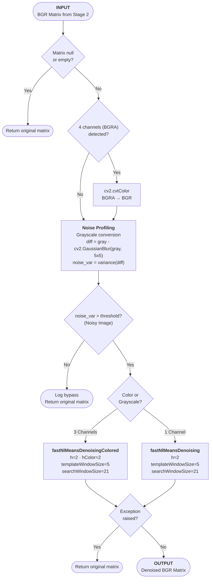

# Stage 3: Adaptive Denoising

## 1. Architectural Purpose (The "Why")
Physical receipts scanned via cameras contain high-frequency sensor noise, paper textures, and compression artifacts. If these smudges are passed directly to thresholding and upscaling layers, they expand into dark speckles that interfere with text recognition.

However, running Non-Local Means (NLM) denoising is computationally expensive (taking 5-15 seconds on standard CPUs for high-resolution images). Stage 3 solves this by profiling image noise and dynamically bypassing the NLM step on clean inputs to optimize latency.

---

## 2. Mathematical Concept & Mechanics

### A. High-Frequency Noise Profiling
To evaluate the noise level of the incoming matrix:
1. **Gaussian Difference**: Blurs the grayscale channel of the image ($I$) with a tight $5 \times 5$ kernel to create a smooth representation ($I_{blur}$).
2. **Noise Estimate ($\sigma^2_{noise}$)**: Computes the variance of the pixel difference between the blurred and original image:

$$\sigma^2_{noise} = \text{Variance}(I - I_{blur})$$

- **Dynamic Gate**: If $\sigma^2_{noise}$ is below a threshold (indicating a clean digital scan or pre-enhanced input), the NLM filter is bypassed, reducing execution time to milliseconds.

### B. Micro-Font Non-Local Means (NLM)
If the noise profile exceeds the threshold, the engine runs NLM denoising:
- **Search Window ($21 \times 21$)**: Scans the surrounding neighborhood for similar templates.
- **Template Window ($5 \times 5$)**: Set tighter than standard CV defaults (which use $7 \times 7$) to prevent blurring fine diacritics and tiny number fonts.
- **Denoising strength ($h=2$, $hColor=2$)**: Gentle filtering that preserves edge contrast.
- **Alpha Channel Guard**: If a transparent PNG is input (4 channels), it converts it to standard 3-channel BGR (`cv2.COLOR_BGRA2BGR`) to prevent OpenCV runtime crashes.

---

## 3. Algorithmic Workflow

