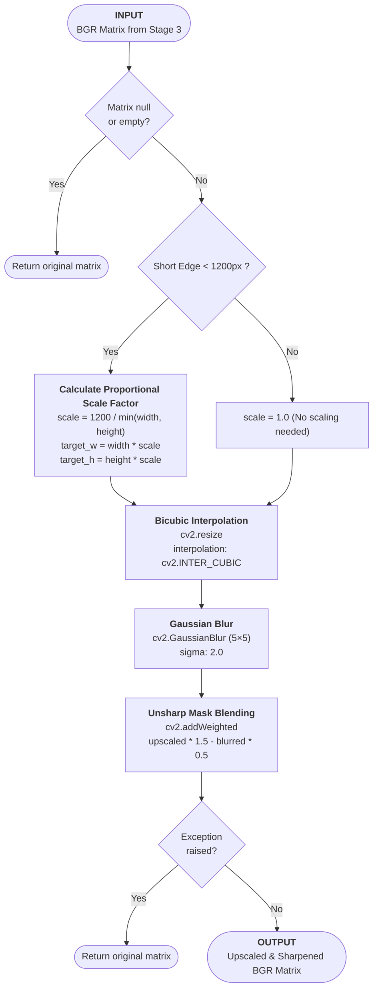

# Stage 4: High-Fidelity Upscaling & Sharpening

## 1. Architectural Purpose (The "Why")
Invoices and thermal receipts often arrive at low resolutions (100 to 150 DPI). When text character boundaries are small, individual characters blend together or wash out, causing OCR engines to misidentify characters (e.g., confusing `8` with `B`, or `0` with `O`).

Stage 4 scales low-resolution inputs up to a standard size optimized for character recognition. It uses **proportional target scaling** to ensure text edges contain sufficient pixel data, combined with a **bounded sharpening filter** to keep outlines distinct.

---

## 2. Mathematical Concept & Mechanics

### A. Target Short-Edge Scaling
Instead of applying a rigid `2x` multiplier that can make large images unnecessarily large, Stage 4 evaluates the dimensions of the document:
1. Identifies the shorter edge: $\min(\text{width}, \text{height})$.
2. If the short edge is under $1200\text{px}$, computes the scaling factor ($S$) needed to reach $1200\text{px}$:

$$S = \frac{1200}{\min(\text{width}, \text{height})}$$

3. Scales the image by $S$ using **Bicubic Spline Interpolation** (`cv2.INTER_CUBIC`). The algorithm evaluates a $4 \times 4$ pixel neighborhood to fit a third-degree polynomial, preventing staircase boundary artifacts.

### B. Bounded Unsharp Masking
Upscaling naturally softens text edges. To restore sharpness, a high-pass unsharp mask is applied:
1. Applies a Gaussian blur with $\sigma=2.0$ to the upscaled image.
2. **$5 \times 5$ Bounded Kernel**: Rather than letting the kernel size scale dynamically (which can reach $15 \times 15$ and cause halo artifacts on small, dense print), the kernel is locked to $5 \times 5$.
3. Blends the high-contrast edges back using:

$$\text{Output} = (\text{Upscaled} \times 1.5) - (\text{Blurred} \times 0.5)$$

---

## 3. Algorithmic Workflow

