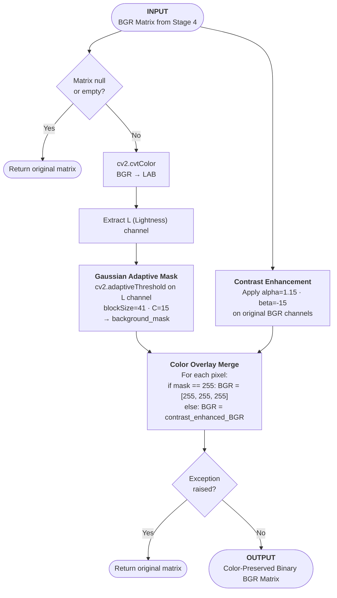

# Stage 5: CamScanner "Magic Color" Binarization

## 1. Architectural Purpose (The "Why")
Converting an image to flat black-and-white (binary) destroys color details. Real-world receipts often contain crucial color markers: red/blue merchant stamps, colorful store logos, or colored ballpoint pen handwriting. Traditional adaptive binarization turns these details into solid black blocks or erases them, causing data loss.

Stage 5 replicates CamScanner's **Magic Color** mode. It segments the background paper to a clean white color while preserving original colored text, stamps, and logos in a high-contrast BGR image.

---

## 2. Mathematical Concept & Mechanics

```
       [ Stage 4 Upscaled Input ]
                   │
         ┌─────────┴─────────┐
         ▼                   ▼
   [ Lightness L ]     [ BGR Colors ]
         │                   │
   (Adaptive Mask)     (Contrast Boost)
         │                   │
         ▼                   ▼
   [ Background Mask ]  [ Enhanced BGR ]
         │                   │
         └─────────┬─────────┘
                   ▼
       [ Mask Overlay Operation ]
       Paper pixels → Pure White
       Ink & Stamp pixels → BGR Color
```

### Steps:
1. **Lightness Channel Segmentation**:
   - Converts the input image to the LAB color space.
   - Extracts the L (Lightness) channel to isolate intensity from color.
2. **Adaptive Background Masking**:
   - Runs Gaussian adaptive thresholding (`cv2.adaptiveThreshold`) on the lightness channel.
   - Using a neighborhood block size of `41` and a noise tuning constant $C$ (dynamically calculated based on local contrast to prevent speckles), isolates the light paper background from dark ink regions.
   - Output: A binary background mask where paper pixels are `255` (white) and text/ink pixels are `0` (black).
3. **Color Contrast Boosting**:
   - Applies contrast stretching to the original BGR channels:

$$\text{Enhanced} = \text{BGR} \times 1.15 - 15$$

   - This sharpens ink outlines and increases color saturation.
4. **Foreground Overlay**:
   - Recombines the mask and color details.
   - Pixels classified as background are forced to pure white `[255, 255, 255]`.
   - Pixels classified as foreground (stamps, logos, text) retain their enhanced BGR values.

---

## 3. Algorithmic Workflow


