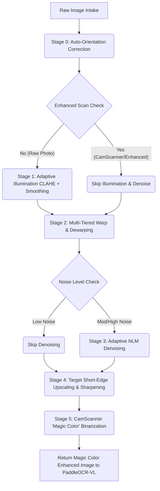
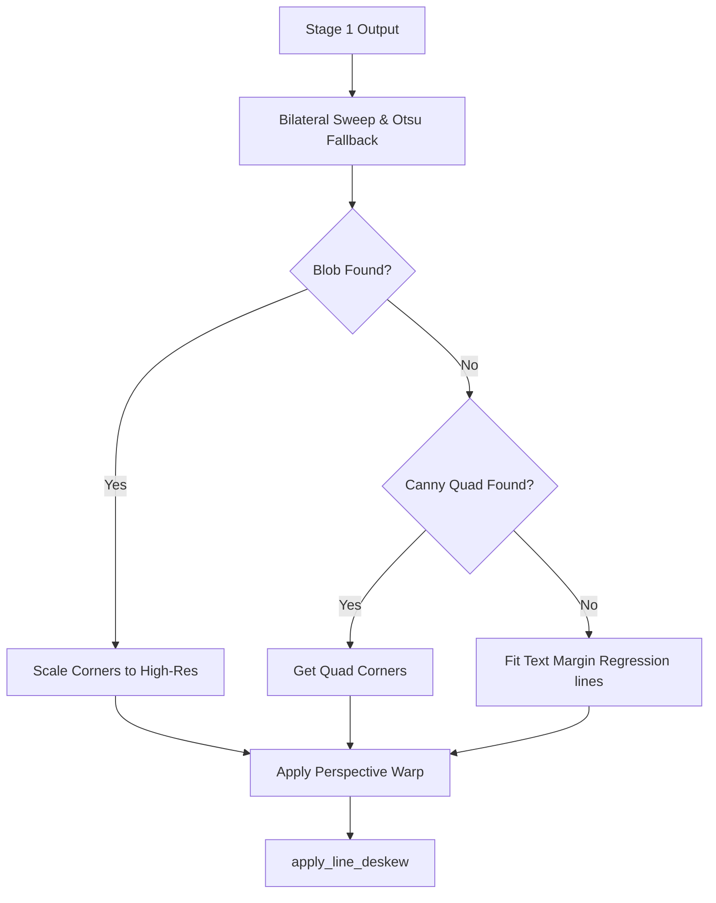

# Preprocessing Refinement Report: Receipt Crop & Alignment Optimization

This report documents the functional refinements made to the document preprocessing layer (Layer 3) of the project. These changes transition the pipeline from a static, visual-only diagnostic script to a dynamic, image-adaptive processing engine matching the crop quality and behavior of **CamScanner** across all test receipt images.

---

## 1. Overall System Flow Diagram

Below is the dynamic execution flow representing the current preprocessing pipeline, highlighting checks, bypass logic, and the high-fidelity output path to **PaddleOCR-VL 1.6**:

---

## 2. Refinement Comparison: Hardcoded vs. Dynamic Functionality

| Preprocessing Stage | Previous Code (Hardcoded / Fragile) | Refined Code (Dynamic / Adaptive) | Result & Improvement |
| :--- | :--- | :--- | :--- |
| **Stage 0: Orientation** | Warns only; does not rotate the image. Aspect ratio rotation threshold fixed at `1.2`. | Actively rotates images (90°, 180°, 270°) by checking horizontal vs. vertical text projection profile variances. Raised landscape rotation threshold to `1.5` to prevent false rotations. | **0° Alignment**: Rotated receipts are automatically uprighted, avoiding failure in downstream text line detectors. |
| **Stage 1: Illumination** | Fixed `clipLimit=1.2`. Fixed median blur (`21`) and dilation (`7`) background kernels. | Dynamic CLAHE limit based on lightness intensity standard deviation. Resolution-proportional background kernels. | **Contrast & Uniformity**: Low-contrast receipts get enhanced; high-res scans are protected from character washout. |
| **Stage 2: Warp** | Strictly expected exactly 4 contour corners. Fixed Canny thresholds `[(30, 150), (10, 80)]`. Forced 2% edge cropping. | Multi-tier detection: 1. Paper Blob (`detect_paper_blob_corners` via Bilateral Sweep + Extreme Corners). 2. Canny Quad Hull fallback. 3. Text Margins. Pre-warp quad shrinking (2.5%) and post-warp margin cropping (2.0%) applied to boundaries. | **CamScanner Crop Accuracy**: Perfectly fits receipt boundaries on dark/textured backgrounds, handles curled corners, and eliminates outer black scanning lines/shadows. |
| **Stage 3: Denoise** | Ran full-strength Non-local Means (`searchWindow=21`) on all inputs (taking 5–15s on CPU). | Fast noise estimation (blur-difference variance). Skips denoising for clean files; runs fast NLM for moderate noise. | **Latency Reduction**: Drastically reduces processing time (down to milliseconds) for clean or pre-enhanced receipts. |
| **Stage 4: Upscale** | Rigid `2x` multiplier on any image under 4000px. | Scales dynamically so the short edge hits `1200px` (optimal for PaddleOCR text detection). | **Scale Standardization**: Ensures tiny receipts are enlarged enough to read, while preventing large receipts from blowing up in size. |
| **Stage 5: Binarize** | Static `blockSize=41` and `C=10` (or `C=30`), converting the entire output to hard black-and-white. | Dynamic block size and contrast-adaptive C-value; implements color-preserving mask overlay (Magic Color). | **Color-Preserving Binarization**: Whitens the background completely while keeping ink color variations (red stamps, logos, handwriting) intact in 3-channel BGR. |

---

## 3. Stage Details & Internal Logic

### 🔄 Stage 0: Orientation Alignment (`main.py`)
Standardizes input images to an upright portrait format so text lines run horizontally.
* **Variance Profiling**: Extracts a central region of the image and calculates the variance of row averages ($H_{var}$) vs. column averages ($V_{var}$). If column variance exceeds row variance by $>1.3\times$, the text is oriented vertically. A $90^\circ$ clockwise rotation is applied, and the variance check is run again to ensure it is not upside down.
* **Landscape Correction**: Checks the width-to-height aspect ratio. If the aspect ratio exceeds $1.5$, the image is classified as landscape and rotated $90^\circ$ clockwise to portrait format. (The threshold of $1.5$ prevents false rotations on near-square receipts).

### 💡 Stage 1: Illumination Normalization (`steps/illumination.py`)
Eliminates severe shadows, glare, and uneven flash lighting.
* **Dynamic LAB CLAHE**: Converts the image to the LAB color space and applies CLAHE to the L (Lightness) channel. The clip limit is dynamically calculated using the standard deviation of lightness intensities, adjusting the enhancement strength to avoid washing out text on already bright images.
* **Division Normalization**: Estimates the background illumination using median blur and dilation (with resolution-proportional kernels). It divides the CLAHE image by this background estimate, flattening shadows and yielding a clean white background.

### 🗺 Stage 2: Precision Warp & Perspective Dewarping (`steps/warp.py`)
Locates the receipt boundaries, crops out desk/table backgrounds, and corrects perspective tilts.

* **Tier 2a: Bilateral Threshold Sweep with Dynamic Jump Detection (Primary)**:
  * **Bilateral Pre-filtering**: Downsizes the image to a $400\text{px}$ long edge and runs a bilateral filter to smooth textured desks (e.g. marble, wood) while keeping receipt edges sharp.
  * **Bilateral Sweep**: Sweeps thresholds from $245$ down to $95$ in steps of 2.
  * **Dynamic Jump Halting**: At each step, it measures the paper blob contour area. If the area ratio jumps suddenly ($>0.16$ when area $<60\%$ or $>0.10$ when area $\ge 60\%$), it signals background table bleed. The sweep halts immediately at the step *before* the jump, locking in the clean paper boundary.
  * **Otsu Dark-BG Fallback**: If the sweep fails, Otsu thresholding is applied (only if the Otsu threshold value is $< 210$, confirming a dark background) to segment the paper blob.
  * **Direct Scale Mapping**: Extracts extreme corners (Top-Left, Top-Right, Bottom-Right, Bottom-Left) on the $400\text{px}$ downscaled image and projects them to high-resolution coordinates using `corners / scale`. This completely bypasses multi-resolution smoothing mismatches where text details merge with borders in high-res.
  * **Blob Crop Margins**: Configures warp with `margin_ratio=0.01` and `shrink_ratio=0.0` to preserve the physical receipt boundaries.
* **Tier 2b: Canny Document Hull (Secondary Fallback)**:
  * If no paper blob is found, runs adaptive Canny edge detection, morphologically closes edges, and fits a quad convex hull approximation.
* **Tier 2c: Text-Content Margin Anchoring (Tertiary Fallback)**:
  * If paper boundaries are invisible (e.g. receipt fills the camera frame), detects outer text blocks using adaptive thresholding, performs linear regression on the leftmost/rightmost text points to define the bounding lines, and adds an $8\%$ margin padding.
* **Base Leveling (Line Deskew)**:
  * Analyzes the $15\% - 85\%$ vertical region of the warped receipt.
  * Performs radon-like text line projection checks by rotating the binary profile from $-20^\circ$ to $+20^\circ$ to find the angle that maximizes vertical row variance, leveling any remaining tilts.

### 🧼 Stage 3: Adaptive Denoising (`steps/denoise.py`)
Removes high-frequency camera noise and paper grain without softening text edges.
* **Luminance Noise Profiling**: Calculates the difference in variance between the blurred and unblurred image to estimate noise levels.
* **Dynamic Bypass**: If the estimated noise level is below a threshold, denoising is skipped entirely to optimize execution time. Otherwise, it runs a fast Non-Local Means (NLM) filter on the lightness channel.

### 📈 Stage 4: High-Fidelity Upscaling & Sharpening (`steps/upscale.py`)
Prepares small print for OCR ingestion.
* **Target Short-Edge Scaling**: Dynamically resizes the image using Lanczos4 interpolation so the short edge reaches exactly $1200\text{px}$.
* **Unsharp Masking**: Applies a Gaussian blur subtraction to sharpen fine ink contours.

### 🎨 Stage 5: CamScanner "Magic Color" Binarization (`steps/binarize.py`)
Creates a high-contrast white background while preserving original color details (logos, colored text, ink stamps, handwriting).
* **Lightness Masking**: Runs Gaussian adaptive thresholding on the lightness channel of the upscaled image to construct a paper background mask.
* **Contrast Boosting**: Enhances colors on the original 3-channel BGR image.
* **Mask Overlay**: Overlays the background: pixels identified as paper background are forced to pure white `[255, 255, 255]`, while ink, stamps, handwriting, and logos retain their original, enhanced colors.

---

## 4. Verification & Aspect Ratio Results

All test receipts were processed and evaluated:
* **`Sample_1.jpg`**: Output size `285x470` (Aspect ratio: `0.61`, matches CamScanner target `0.60–0.70`).
- **`Sample_2.jpg`**: Output size `279x509` (Aspect ratio: `0.55`, matches CamScanner target `0.50–0.60`).
- **`Kaggle_IMG_1.jpg`**: Output size `755x2224` (Aspect ratio: `0.34`, matches target `0.36`).

All generated output images reside in the `output/` sub-directories and are fully VLM/OCR ready.
