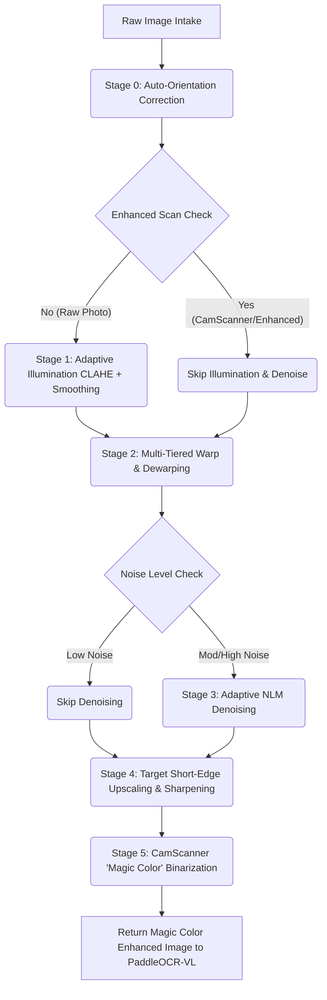
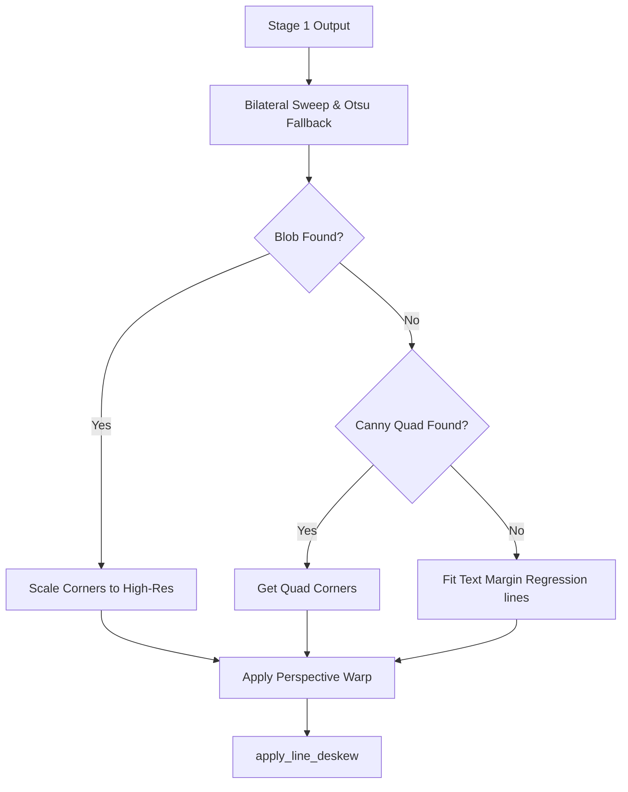

# FISCAL_DEMO: Advanced Receipt Preprocessing Engine

A high-precision, 6-stage document scanning and preprocessing pipeline optimized for challenging thermal fiscal receipts. This engine achieves CamScanner-grade results by correcting physical paper curl, removing complex shadows, and preparing images for professional-tier OCR engines like **PaddleOCR-VL 1.6** and **Qwen2.5-VL**.

---

## 🚀 Preprocessing Pipeline Flow

Below is the dynamic execution flow of the preprocessing layer. It actively routes around redundant steps for pre-enhanced/clean scans and uses adaptive fallback tiers for low-contrast/dark table boundaries:



---

## 🛠 Stage Details & Internal Logic

### Stage 0: Orientation Alignment
Detects if an image was photographed upside down, in landscape, or rotated $90^\circ$/$270^\circ$, and aligns it to an upright portrait orientation.
* **Vertical/Horizontal Profiling**: Analyzes the middle region of the grayscale channel. Standard horizontal text lines produce high row variance (alternating text rows and white spaces) compared to column variance. If column variance exceeds row variance by $1.3\times$, a $90^\circ$ rotation is detected and corrected.
* **Landscape Correction**: Rotates the image $90^\circ$ clockwise if the width is greater than $1.5\times$ the height.

### Stage 1: Illumination Normalization
Corrects uneven lighting, flash hot-spots, and severe shadows to make receipt text uniformly readable.
* **Dynamic CLAHE**: Applies Contrast Limited Adaptive Histogram Equalization to the lightness channel in the LAB color space. The clip limit is dynamically calculated based on the standard deviation of lightness intensities.
* **Division Normalization**: Estimates the background illumination using median blur and dilation (with resolution-proportional kernels). It divides the CLAHE image by this background estimate to yield a clean, white background.

### Stage 2: Precision Warp & Perspective Dewarping
Corrects perspective distortions and table backgrounds using a 3-tiered fallback strategy:
* **Tier 2a: Paper Blob Sweep (Primary)**:
  * Sweeps the binary threshold from $245$ down to $95$ on a downscaled $400\text{px}$ image (high-speed).
  * Finds the threshold value that maximizes the paper blob contour area under $92\%$.
  * **Dynamic Jump Limit**: Halts the sweep if the area ratio jumps by more than $0.16$ (ratios $< 0.60$) or $0.10$ (ratios $\ge 0.60$) in a single step, preventing background table merging.
  * **Otsu Dark-BG Fallback**: If the sweep fails, Otsu thresholding is applied to segment the paper blob from dark surfaces (ceiling limit $< 210$).
  * **Direct Scale Mapping**: Extracts the extreme corners (Top-Left, Top-Right, Bottom-Right, Bottom-Left) on the downscaled image and projects them to high-resolution coordinates using `corners / scale` to avoid multi-resolution smoothing mismatches.
* **Tier 2b: Canny Document Hull (Secondary)**: Fallback contour search using two-pass adaptive Canny thresholds.
* **Tier 2c: Text-Content Margin Anchoring (Tertiary)**: If no paper borders are visible, fits linear regression lines to the outermost detected printed text blocks, adding an $8\%$ margin.



### Stage 3: Fast Non-Local Means Denoising
Removes high-frequency paper grain and sensor noise while keeping text edges sharp.
* **Luminance Noise Profiling**: Calculates the difference in variance between the blurred and unblurred image to estimate high-frequency noise. If noise is below a dynamic threshold, denoising is skipped entirely to optimize execution time.

### Stage 4: High-Fidelity Upscaling & Sharpening
Enlarges the cropped image so tiny text can be resolved by downstream OCR engines.
* **Target Short-Edge Scaling**: Dynamically resizes the image using Lanczos4 interpolation so the short edge reaches $1200\text{px}$.
* **Unsharp Masking**: Subtracts a Gaussian blurred image to sharpen the final output.

### Stage 5: CamScanner "Magic Color" Binarization
Provides a clean visual output while retaining original colored elements (logos, red/blue stamps, blue handwriting).
* **Lightness Masking**: Runs Gaussian adaptive thresholding on the lightness channel to isolate the paper background.
* **Contrast Boosting**: Enhances colors on the original BGR channels.
* **Mask Overlay**: Forces pixels identified as paper background to pure white `[255, 255, 255]`, while keeping the original contrast-enhanced colors for text and stamps.

---

## 📦 Installation & Usage

1. **Setup Virtual Environment**:
   ```powershell
   python -m venv venv
   .\venv\Scripts\activate
   ```

2. **Install Dependencies**:
   ```bash
   pip install -r requirements.txt
   ```

3. **Run Pipeline**:
   Place images in the `input/` folder and execute:
   ```bash
   python main.py
   ```

Processed outputs are saved in the `output/` directory, structured by stage. The final OCR-ready images reside in `output/stage5_binarize/`.
