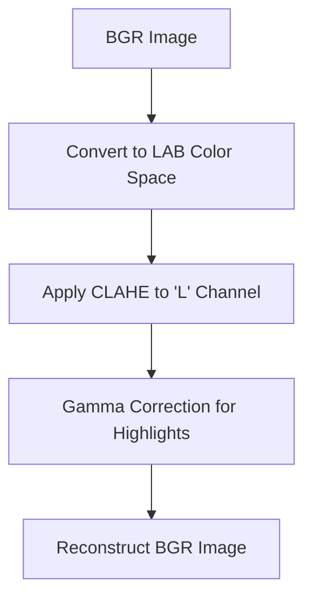
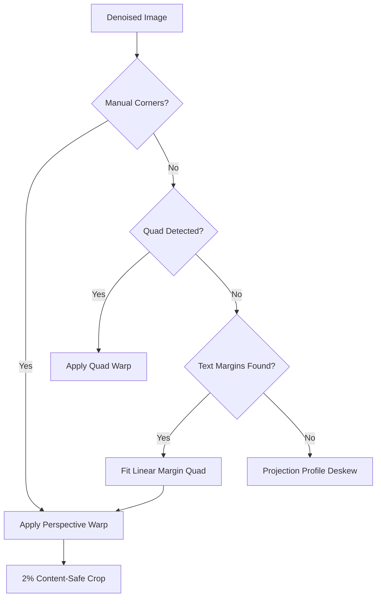

# FISCAL_DEMO: Advanced Receipt Preprocessing Engine

A high-precision, 5-stage document scanning pipeline optimized for challenging thermal receipts. This engine achieves CamScanner-grade results by correcting physical paper curl, removing complex shadows, and preparing images for professional-tier OCR.

## 🚀 Pipeline Flow Overview


---

## 🛠 Stage Details & Internal Logic

### 1. Illumination Normalization
Balances uneven lighting and deletes harsh shadows to ensure uniform text visibility across the entire receipt.
- **Logic**: Uses CLAHE (Contrast Limited Adaptive Histogram Equalization) and global gamma correction.
- **Internal Flow**:


### 2. Fast Non-Local Means Denoising
Removes paper grain and sensor noise without losing the sharp edges of text characters.
- **Logic**: Replaces standard bilateral filters with FNLM to prevent "soft gray borders" around characters.

### 3. Precision Warp & Multi-Tier Alignment
The core engine for correcting perspective and physical paper curl. This stage uses a 3-tier fallback strategy.
- **The "Curl" Solution**: Uses **Text-Content Margin Anchoring**. By fitting linear regressions to the actual left/right text mass, it corrects for "Smile/Frown" paper bends that simple rotation cannot fix.
- **Internal Flow**:


### 4. High-Fidelity Upscaling
Increases resolution using interpolation methods that preserve text stroke integrity.
- **Logic**: Uses Lanczos4 interpolation followed by an **Unsharp Mask** (Gaussian Blur subtraction) to boost character definition.

### 5. Adaptive Gaussian Binarization
Final conversion to pure Black & White, optimized for OCR engines like Tesseract or Google Vision.
- **Logic**: Uses Adaptive Gaussian Thresholding with a precision block size (41) and texture smoothing to eliminate paper grain artifacts.

---

## 📦 Installation & Usage

1. **Setup Virtual Environment**:
   ```powershell
   python -m venv venv
   .\venv\Scripts\activate
   ```

2. **Install Dependencies**:
   ```bash
   pip install -r requirements.txt
   ```

3. **Run Pipeline**:
   Place images in the `input/` folder and execute:
   ```bash
   python main.py
   ```

Outputs will be generated in the `output/` directory, categorized by stage.
